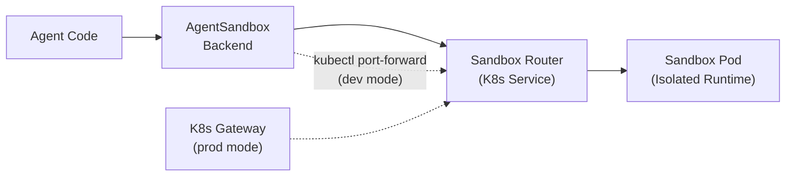

# LangChain Agent Sandbox Backend

A LangChain DeepAgents backend that connects to Kubernetes-native sandbox runtimes via the agent-sandbox Python SDK. Provides secure, isolated execution environments for AI agents with full filesystem virtualization.

## Architecture

The backend connects to sandboxes through a **Router** service that handles request routing to the correct sandbox pod:



Three connection modes are supported:

| Mode | When to Use | How It Works |
|------|-------------|--------------|
| **Developer (Tunnel)** | Local development, CI | Auto-creates `kubectl port-forward` to Router |
| **Production (Gateway)** | Cloud deployments | Discovers Kubernetes Gateway IP automatically |
| **Direct (API URL)** | In-cluster agents, custom domains | Connects directly to provided URL |

## Documentation Index

| Section | Description |
|---------|-------------|
| [Installation](#installation) | Install the package and dependencies |
| [Quickstart](#quickstart) | Get started with different backend configurations |
| [Connection Modes](#connection-modes) | Developer, Production, and Direct modes |
| [Factory Pattern](#factory-pattern) | Runtime-dependent initialization for `create_deep_agent()` |
| [Composite Routing](#composite-routing) | Route paths to different backends |
| [Policy Wrapper](#policy-wrapper) | Enterprise restrictions and audit logging |
| [WarmPool Backend](#warmpool-backend) | Fast startup with pre-warmed pods |
| [API Reference](#api-reference) | Complete protocol implementation details |

## Installation

```sh
# Install from git (not yet published to PyPI)
pip install "git+https://github.com/kubernetes-sigs/agent-sandbox.git@main#subdirectory=clients/python/langchain-agent-sandbox"

# Also requires k8s-agent-sandbox client
pip install "git+https://github.com/kubernetes-sigs/agent-sandbox.git@main#subdirectory=clients/python/agentic-sandbox-client"
```

**Requirements:**
- Python 3.11+
- `k8s-agent-sandbox` SDK
- `deepagents` package
- Kubernetes cluster with agent-sandbox controller
- `kubectl` installed and configured (for Gateway discovery and Tunnel mode)

## Quickstart

| Backend | Description |
|---------|-------------|
| [Direct sandbox](#direct-sandbox) | `AgentSandboxBackend(sandbox)` <br/> Use an existing `Sandbox` handle directly. |
| [From template](#from-template) | `AgentSandboxBackend.from_template("my-template")` <br/> Auto-managed sandbox lifecycle with context manager support. |
| [Factory pattern](#factory-pattern) | `create_sandbox_backend_factory("my-template")` <br/> For use with `create_deep_agent(backend=...)`. |
| [WarmPool](#warmpool-backend) | `WarmPoolBackend.from_warmpool("my-template")` <br/> Faster startup with pre-warmed sandbox pods. |
| [With policies](#policy-wrapper) | `SandboxPolicyWrapper(backend, deny_prefixes=["/etc"])` <br/> Restrictions on paths and commands. |

### Direct sandbox

```python
from k8s_agent_sandbox import SandboxClient
from deepagents import create_deep_agent
from langchain_agent_sandbox import AgentSandboxBackend

client = SandboxClient()
sandbox = client.create_sandbox(template="my-template", namespace="default")
backend = AgentSandboxBackend(sandbox, root_dir="/app")
agent = create_deep_agent(backend=backend)
result = agent.invoke("List files in the sandbox")
# Cleanup: client.delete_sandbox(sandbox.claim_name, sandbox.namespace)
```

### From template

```python
from deepagents import create_deep_agent
from langchain_agent_sandbox import AgentSandboxBackend

# Backend manages client lifecycle automatically
with AgentSandboxBackend.from_template("my-template", namespace="default") as backend:
    agent = create_deep_agent(backend=backend)
    result = agent.invoke("Create a Python script that prints hello world")
```

## Connection Modes

### Developer Mode (Local/CI)

When no `gateway_name` or `api_url` is provided, the client automatically creates a secure tunnel using `kubectl port-forward`. This is the simplest setup for local development.

```python
from deepagents import create_deep_agent
from langchain_agent_sandbox import AgentSandboxBackend

# Tunnel mode - auto port-forwards to Router service
with AgentSandboxBackend.from_template(
    template_name="python-sandbox",
    namespace="default",
) as backend:
    agent = create_deep_agent(backend=backend)
    result = agent.invoke({"messages": [("user", "echo hello")]})
    print(result)
```

### Production Mode (Gateway)

For cloud deployments with a Kubernetes Gateway (e.g., GKE Gateway Controller), specify the gateway name:

```python
from langchain_agent_sandbox import AgentSandboxBackend

with AgentSandboxBackend.from_template(
    template_name="python-sandbox",
    namespace="production",
    gateway_name="external-http-gateway",      # Gateway resource name
    gateway_namespace="agent-sandbox-system",  # Where Gateway lives
) as backend:
    # Client auto-discovers Gateway IP
    agent = create_deep_agent(backend=backend)
    # ...
```

### Direct Mode (In-Cluster / Custom Domain)

For agents running inside the cluster or when using a custom domain:

```python
from langchain_agent_sandbox import AgentSandboxBackend

# In-cluster: use Kubernetes DNS
with AgentSandboxBackend.from_template(
    template_name="python-sandbox",
    namespace="default",
    api_url="http://sandbox-router-svc.default.svc.cluster.local:8080",
) as backend:
    # ...

# Custom domain
with AgentSandboxBackend.from_template(
    template_name="python-sandbox",
    namespace="default",
    api_url="https://sandbox.example.com",
) as backend:
    # ...
```

## Factory Pattern

For use with `create_deep_agent()`, which expects a `BackendFactory` callable that accepts a `ToolRuntime`:

```python
from deepagents import create_deep_agent
from langchain_agent_sandbox import create_sandbox_backend_factory

# Create factory - returns Callable[[ToolRuntime], AgentSandboxBackend]
factory = create_sandbox_backend_factory(
    template_name="python-runtime",
    namespace="agents",
    root_dir="/workspace",
)

# Pass factory to create_deep_agent
agent = create_deep_agent(backend=factory)

# The backend is created when the agent runs
result = agent.invoke("Analyze the project structure")
```

**How it works:**
- The factory is called with a `ToolRuntime` when the agent initializes
- Our backend doesn't use the runtime's `state` or `store` since execution happens in the sandbox
- The factory creates a new `AgentSandboxBackend.from_template()` each time

**Best for:**
- Standard DeepAgents integration
- When you need runtime-dependent initialization
- Stateless agent deployments

## Composite Routing

Combine sandbox execution with other backends using DeepAgents' `CompositeBackend`:

```python
from deepagents import create_deep_agent
from deepagents.backends import CompositeBackend, StateBackend, StoreBackend
from langchain_agent_sandbox import AgentSandboxBackend
from langgraph.store.memory import InMemoryStore

# Create sandbox backend outside the factory to manage lifecycle properly
with AgentSandboxBackend.from_template("python-runtime") as sandbox:
    # Factory creates composite backend using the managed sandbox
    def create_composite(runtime):
        return CompositeBackend(
            default=StateBackend(runtime),
            routes={
                "/sandbox/": sandbox,
                "/memories/": StoreBackend(runtime),
            }
        )

    agent = create_deep_agent(
        backend=create_composite,
        store=InMemoryStore()
    )

    # Use agent within the context manager
    result = agent.invoke("Run script in sandbox")
```

**Routing behavior:**
- `/workspace/notes.md` → `StateBackend` (ephemeral)
- `/sandbox/script.py` → `AgentSandboxBackend` (isolated execution)
- `/memories/context.md` → `StoreBackend` (persistent)

**Best for:**
- Hybrid workflows mixing local scratch space with isolated execution
- Agents that need both ephemeral working memory and secure code execution
- Multi-tenant deployments with shared state but isolated sandboxes

## Policy Wrapper

Enforce enterprise restrictions on sandbox operations:

```python
from langchain_agent_sandbox import AgentSandboxBackend, SandboxPolicyWrapper

backend = AgentSandboxBackend.from_template("my-template")

# Wrap with policy enforcement
secured = SandboxPolicyWrapper(
    backend,
    deny_prefixes=["/etc", "/sys", "/proc", "/root"],
    deny_commands=["rm -rf", "shutdown", "reboot", "curl", "wget"],
    audit_log=lambda op, target, meta: print(f"[AUDIT] {op}: {target} {meta}")
)

with secured:
    agent = create_deep_agent(backend=secured)
    result = agent.invoke("Run the analysis script")
```

The policy wrapper is a best-effort guardrail, not a security boundary. It canonicalizes paths before deny-prefix checks (for example `/app/../etc` is treated as `/etc`), but command pattern checks can still be bypassed with shell tricks. Use kernel-level isolation (for example gVisor or Kata Containers) for stronger containment.

### Policy options

| Option | Type | Description |
|--------|------|-------------|
| `deny_prefixes` | `List[str]` | Block writes/edits under these path prefixes |
| `deny_commands` | `List[str]` | Block commands containing these patterns |
| `audit_log` | `Callable[[str, str, dict], None]` | Called for every operation with `(operation, target, metadata)` |

### Behavior

**Read operations pass through without checks:**
- `ls`, `read`, `grep`, `glob`, `download_files`

**Write operations are guarded:**
- `write` - Returns error if path matches `deny_prefixes`
- `edit` - Returns error if path matches `deny_prefixes`
- `execute` - Returns error if command contains `deny_commands` pattern
- `upload_files` - Filters out files matching `deny_prefixes`

**Audit logging:**
```python
def audit_log(operation: str, target: str, metadata: dict) -> None:
    # operation: "write", "edit", "execute", "upload"
    # target: file path or command string
    # metadata: {"size": int} for write, {"replace_all": bool} for edit, etc.
    logger.info(f"{operation} on {target}", extra=metadata)
```

**Best for:**
- Enterprise compliance requirements
- Multi-tenant environments with strict isolation
- Audit trails for regulatory compliance
- Preventing accidental system modifications

## WarmPool Backend

For faster startup times using pre-warmed sandbox pods:

```python
from langchain_agent_sandbox import WarmPoolBackend

# Expects a SandboxWarmPool to exist with matching template
with WarmPoolBackend.from_warmpool(
    template_name="python-runtime",
    namespace="agents",
    warmpool_name="python-pool",  # Optional: explicit warmpool reference
) as backend:
    agent = create_deep_agent(backend=backend)

    # Check adoption info
    info = backend.get_adoption_info()
    print(f"From warmpool: {info['from_warmpool']}")

    result = agent.invoke("Run expensive computation")
```

**How it works:**
- When a `SandboxClaim` is created with a `sandboxTemplateRef`, the controller automatically adopts from any `SandboxWarmPool` using the same template
- The `WarmPoolBackend` is currently equivalent to `AgentSandboxBackend.from_template()` since adoption is automatic
- Provides explicit intent that warmpool usage is expected
- Future extension point for explicit warmpool selection

**Best for:**
- Latency-sensitive applications
- High-throughput agent deployments
- Scenarios requiring rapid sandbox provisioning

## API Reference

### AgentSandboxBackend

The core backend implementing the DeepAgents `SandboxBackendProtocol`.

```python
class AgentSandboxBackend(SandboxBackendProtocol):
    def __init__(
        self,
        sandbox: Sandbox,
        root_dir: str = "/app",
        manage_lifecycle: bool = False,
        allow_absolute_paths: bool = False,
        sdk_client: Optional[SandboxClient] = None,
    ) -> None: ...

    @classmethod
    def from_template(
        cls,
        template_name: str,
        namespace: str = "default",
        gateway_name: Optional[str] = None,
        gateway_namespace: str = "default",
        api_url: Optional[str] = None,
        server_port: int = 8888,
        root_dir: str = "/app",
        allow_absolute_paths: bool = False,
        sandbox_ready_timeout: int = 180,
    ) -> "AgentSandboxBackend": ...
```

**Protocol methods:**

| Method | Returns | Description |
|--------|---------|-------------|
| `execute(command, *, timeout=None)` | `ExecuteResponse` | Run shell command in sandbox |
| `ls(path)` | `LsResult` | List directory contents |
| `read(file_path, offset, limit)` | `ReadResult` | Read file content (middleware formats line numbers) |
| `write(file_path, content)` | `WriteResult` | Create new file (fails if exists) |
| `edit(file_path, old, new, replace_all)` | `EditResult` | Replace string in file |
| `grep(pattern, path, glob)` | `GrepResult` | Search file contents |
| `glob(pattern, path)` | `GlobResult` | Find files by pattern |
| `upload_files(files)` | `List[FileUploadResponse]` | Upload multiple files |
| `download_files(paths)` | `List[FileDownloadResponse]` | Download multiple files |

All methods have async variants prefixed with `a` (e.g., `aexecute`, `aread`).

### create_sandbox_backend_factory

```python
def create_sandbox_backend_factory(
    template_name: str,
    namespace: str = "default",
) -> Callable[[Any], AgentSandboxBackend]: ...
```

Returns a factory callable for use with `create_deep_agent(backend=...)`.

### SandboxPolicyWrapper

```python
class SandboxPolicyWrapper:
    def __init__(
        self,
        backend: AgentSandboxBackend,
        deny_prefixes: Optional[List[str]] = None,
        deny_commands: Optional[List[str]] = None,
        audit_log: Optional[Callable[[str, str, dict], None]] = None,
    ) -> None: ...
```

Wraps any `AgentSandboxBackend` with policy enforcement. Implements the same protocol methods.

### WarmPoolBackend

```python
class WarmPoolBackend(AgentSandboxBackend):
    @classmethod
    def from_warmpool(
        cls,
        template_name: str,
        namespace: str = "default",
        warmpool_name: Optional[str] = None,
    ) -> "WarmPoolBackend": ...

    def get_adoption_info(self) -> dict: ...
```

Subclass optimized for warmpool usage. The `get_adoption_info()` method returns:
```python
{
    "warmpool_name": str | None,  # Configured warmpool name (if specified)
    "from_warmpool": bool,        # True if warmpool_name parameter was specified
                                  # NOTE: Does NOT indicate actual warmpool adoption
}
```

## Path Virtualization

All file operations are virtualized under `root_dir` (default: `/app`):
- Public path `/file.txt` maps to internal path `/app/file.txt`
- Path traversal attacks (`../`) are blocked
- The `id` property returns the sandbox/claim name for identification

## Sandbox Image Requirements

The sandbox container image must include these POSIX utilities:
- `sh` - Shell for command execution
- `grep` - Content search
- `find` - File discovery
- `mkdir` - Directory creation
- `ls` - Directory listing
- `test` - File existence checks

## Environment Variables

For development and testing:

| Variable | Description |
|----------|-------------|
| `LANGCHAIN_SANDBOX_TEMPLATE` | Default template name |
| `LANGCHAIN_NAMESPACE` | Default Kubernetes namespace |
| `LANGCHAIN_API_URL` | Direct API URL (bypasses gateway) |
| `LANGCHAIN_SERVER_PORT` | Sandbox runtime port (default: 8888) |
| `LANGCHAIN_ROOT_DIR` | Virtual filesystem root (default: /app) |

Note: Tunnel mode is auto-enabled when no `gateway_name` or `api_url` is provided.

## Development

```sh
# Install dependencies
uv sync

# Run tests
uv run pytest tests/ -v
```

## Related

- [agent-sandbox](https://github.com/kubernetes-sigs/agent-sandbox) - Kubernetes CRD and controller
- [agentic-sandbox-client](../agentic-sandbox-client) - Core Python SDK
- [DeepAgents](https://docs.langchain.com/deepagents) - LangChain agent framework
