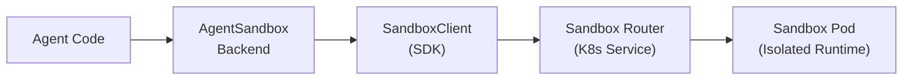

# LangChain Agent Sandbox Backend

A LangChain DeepAgents backend that connects to Kubernetes-native sandbox runtimes via the agent-sandbox Python SDK. Provides secure, isolated execution environments for AI agents with full filesystem virtualization, session reattach, and drain-safe lifecycle management.

## Architecture



Connection mode (tunnel, gateway, direct) is configured on the `SandboxClient` -- the adapter does not expose transport details:

| Mode | When to Use | SandboxClient Config |
|------|-------------|---------------------|
| **Tunnel** | Local development, CI | `SandboxLocalTunnelConnectionConfig()` |
| **Gateway** | Cloud deployments | `SandboxGatewayConnectionConfig(gateway_name=...)` |
| **Direct** | In-cluster, custom domains | `SandboxDirectConnectionConfig(api_url=...)` |

## Installation

```sh
pip install "git+https://github.com/kubernetes-sigs/agent-sandbox.git@main#subdirectory=clients/python/langchain-agent-sandbox"
pip install "git+https://github.com/kubernetes-sigs/agent-sandbox.git@main#subdirectory=clients/python/agentic-sandbox-client"
```

**Requirements:** Python 3.11+, `k8s-agent-sandbox`, `deepagents>=0.5.9`, Kubernetes cluster with agent-sandbox controller, `kubectl`.

## Quickstart

### From existing sandbox (unmanaged)

```python
from k8s_agent_sandbox import SandboxClient
from langchain_agent_sandbox import AgentSandboxBackend

client = SandboxClient()
sandbox = client.create_sandbox(template="my-template")

backend = AgentSandboxBackend.from_existing(sandbox, root_dir="/workspace")
result = backend.execute("echo hello")
# Caller manages lifecycle: client.delete_sandbox(sandbox.claim_name)
```

### From template (managed lifecycle)

```python
from k8s_agent_sandbox import SandboxClient
from deepagents import create_deep_agent
from langchain_agent_sandbox import AgentSandboxBackend

client = SandboxClient()  # tunnel mode by default

with AgentSandboxBackend.from_template(
    client,
    template_name="python-sandbox",
    namespace="default",
) as backend:
    agent = create_deep_agent(backend=backend)
    result = agent.invoke("Create a hello world script")
```

### Session reattach (multi-turn agents)

```python
from k8s_agent_sandbox import SandboxClient
from langchain_agent_sandbox import AgentSandboxBackend

client = SandboxClient()

# First invocation: creates a new sandbox with session label
with AgentSandboxBackend.from_template(
    client,
    template_name="python-sandbox",
    session_id="thread-abc123",
) as backend:
    backend.execute("echo 'state persists' > /workspace/state.txt")
    # On exit: detaches without deleting (session sandbox persists)

# Later invocation: reattaches to the same sandbox
with AgentSandboxBackend.from_template(
    client,
    template_name="python-sandbox",
    session_id="thread-abc123",
) as backend:
    result = backend.read("/state.txt")
    # File from previous invocation is still there
```

**How it works:** When `session_id` is set, `__enter__` searches for an existing
SandboxClaim labelled `agent-sandbox.sigs.k8s.io/session-id=<session_id>`. If found,
it reattaches via `SandboxClient.get_sandbox()`. If not found, it creates a new sandbox
with that label. On `__exit__`, reattached sandboxes are detached (not deleted) so they
persist for future invocations.

### Factory pattern

For use with `create_deep_agent(backend=...)`:

```python
from deepagents import create_deep_agent
from langchain_agent_sandbox import create_sandbox_backend_factory

factory = create_sandbox_backend_factory(
    template_name="python-runtime",
    namespace="agents",
    client=client,
)

agent = create_deep_agent(backend=factory)
result = agent.invoke("Analyze the project structure")
```

The factory eagerly provisions the sandbox and registers a `weakref.finalize` cleanup
handler so the sandbox is torn down on GC or at interpreter shutdown.

### With policies

```python
from langchain_agent_sandbox import AgentSandboxBackend, SandboxPolicyWrapper

client = SandboxClient()

with AgentSandboxBackend.from_template(client, "my-template") as backend:
    secured = SandboxPolicyWrapper(
        backend,
        deny_prefixes=["/etc", "/sys", "/proc"],
        deny_commands=["rm -rf", "shutdown"],
        audit_log=lambda op, target, meta: print(f"[AUDIT] {op}: {target}"),
        strict_audit=False,  # default: fail-open
    )
    agent = create_deep_agent(backend=secured)
    result = agent.invoke("Run the analysis script")
```

The policy wrapper implements `SandboxBackendProtocol` and can be used anywhere a
backend is expected. It is a best-effort guardrail -- kernel-level isolation (gVisor,
Kata Containers) provides the real security boundary.

## Connection Modes

All connection configuration is on `SandboxClient`, not the adapter:

```python
from k8s_agent_sandbox import SandboxClient
from k8s_agent_sandbox.models import (
    SandboxLocalTunnelConnectionConfig,
    SandboxGatewayConnectionConfig,
    SandboxDirectConnectionConfig,
)

# Developer mode (default -- auto port-forward)
client = SandboxClient()

# Production mode (gateway)
client = SandboxClient(
    connection_config=SandboxGatewayConnectionConfig(
        gateway_name="external-http-gateway",
        gateway_namespace="agent-sandbox-system",
    )
)

# Direct mode (in-cluster or custom domain)
client = SandboxClient(
    connection_config=SandboxDirectConnectionConfig(
        api_url="http://sandbox-router.default.svc:8080",
    )
)
```

To enable tracing, pass a `SandboxTracerConfig`:

```python
from k8s_agent_sandbox.models import SandboxTracerConfig

client = SandboxClient(
    tracer_config=SandboxTracerConfig(enable_tracing=True),
)
```

## API Reference

### AgentSandboxBackend

```python
class AgentSandboxBackend(SandboxBackendProtocol):
    @classmethod
    def from_existing(
        cls,
        sandbox: Sandbox,
        root_dir: str = "/workspace",
    ) -> AgentSandboxBackend: ...

    @classmethod
    def from_template(
        cls,
        client: SandboxClient,
        template_name: str,
        namespace: str = "default",
        root_dir: str = "/workspace",
        sandbox_ready_timeout: int = 180,
        labels: Optional[Dict[str, str]] = None,
        shutdown_after_seconds: Optional[int] = None,
        session_id: Optional[str] = None,
        default_timeout_seconds: Optional[int] = 120,
    ) -> AgentSandboxBackend: ...

    @staticmethod
    def delete_all(
        client: SandboxClient,
        namespace: str = "default",
        best_effort: bool = True,
        label_selector: Optional[str] = None,
    ) -> int: ...

    @property
    def id(self) -> str: ...
    # Returns "{namespace}/{claim_name}", e.g. "default/sandbox-claim-a1b2c3d4"
```

**Protocol methods:**

| Method | Returns | Description |
|--------|---------|-------------|
| `execute(command, *, timeout=None)` | `ExecuteResponse` | Run shell command (cwd is `root_dir`) |
| `ls(path)` | `LsResult` | List directory (native endpoint, includes size/modified_at) |
| `read(file_path, offset, limit)` | `ReadResult` | Read file content (strict UTF-8) |
| `write(file_path, content)` | `WriteResult` | Create new file (fails if exists) |
| `edit(file_path, old, new, replace_all)` | `EditResult` | Replace string in file |
| `grep(pattern, path, glob)` | `GrepResult` | Search file contents |
| `glob(pattern, path)` | `GlobResult` | Find files by pattern (includes size/modified_at) |
| `upload_files(files)` | `List[FileUploadResponse]` | Upload files (per-file partial success) |
| `download_files(paths)` | `List[FileDownloadResponse]` | Download files (per-file partial success) |

Async variants are provided by the `SandboxBackendProtocol` base class via `asyncio.to_thread`.

### create_sandbox_backend_factory

```python
def create_sandbox_backend_factory(
    template_name: str,
    namespace: str = "default",
    **kwargs,
) -> Callable[[Any], AgentSandboxBackend]: ...
```

Returns a factory for `create_deep_agent(backend=...)`. Accepts the same kwargs as `from_template()` (including `client`, `session_id`, etc.).

### SandboxPolicyWrapper

```python
class SandboxPolicyWrapper(SandboxBackendProtocol):
    def __init__(
        self,
        backend: AgentSandboxBackend,
        deny_prefixes: Optional[List[str]] = None,
        deny_commands: Optional[List[str]] = None,
        audit_log: Optional[Callable[[str, str, dict], None]] = None,
        *,
        strict_audit: bool = False,
    ) -> None: ...
```

Implements `SandboxBackendProtocol` -- can be used as a drop-in backend replacement.
Read ops pass through; write/edit/execute/upload are guarded by prefix and command checks.
When `strict_audit=True`, operations are refused if the audit callback raises.

## Key Features

### Path virtualization

All file ops are anchored on `root_dir` (default `/workspace`, must
match the sandbox runtime image's WORKDIR):
- Public `/file.txt` maps to internal `/workspace/file.txt`
- Path traversal (`../`) is blocked — paths that resolve outside
  `root_dir` are refused with `ValueError`
- NUL bytes and ASCII control characters are rejected (closes a
  C/syscall truncation vector that bypasses the `..` check)

### Execute cwd alignment

`execute()` runs commands with `cd {root_dir} && {command}` so the shell's
working directory matches the root used by `ls`/`read`/`write`.

### Default timeout

`from_template()` sets `default_timeout_seconds=120` -- a conservative default
below the sandbox-router's 180s proxy timeout. When `execute(timeout=N)` is called
with an explicit timeout, it takes precedence. Set `default_timeout_seconds=None`
to use the SDK's own default (60s).

### Drain-safe lifecycle

`__exit__` waits for all in-flight operations to complete before deleting the
sandbox claim, mirroring the Go SDK's drain semantics. New operations are
rejected with `RuntimeError` once draining starts.

### Namespace-qualified identity

`backend.id` returns `"{namespace}/{claim_name}"` to prevent collisions across namespaces.

## Sandbox Image Requirements

The sandbox container image must include: `sh`, `grep`, `find` (with `-printf`), `mkdir`, `test`.

## Development

```sh
uv sync
uv run pytest tests/ -v
```

## Context Hub sync

`ContextHubSyncedSandboxBackend` wraps any `SandboxBackendProtocol` and
treats one absolute mount point (default `/context`) as a virtualised
filesystem backed by a versioned Context Hub repo. `execute()` and
non-mount file ops pass through to the inner backend; reads/writes
under the mount go through the hub.

### Hub-first commit semantics

- `commit_mode="per_operation"` (default): every successful write/edit/
  upload triggers a hub commit *before* the file is materialised in
  the sandbox. A hub failure leaves the sandbox unchanged.
- `commit_mode="on_exit"`: writes are visible inside the session
  immediately (read-your-writes) but the hub push is deferred until
  `__exit__`. A flush failure on exit propagates to the caller.
- `commit_mode="manual"`: writes are buffered and only pushed when
  `backend.flush()` is called. A successful `flush()` clears the
  buffer; a second call with no new writes is a no-op. A failed
  `flush()` (e.g. transient `HubError`) preserves the buffer so a
  retry can re-attempt the same commit.

Two helpers expose the pending state:

- `backend.pending_changes()` — hub-relative paths that the next flush
  will send (empty under `per_operation`).
- `backend.is_cache_stale()` — set after a hub conflict or a
  post-commit materialization failure. Call `refresh()`-equivalent
  re-enter to resync.

### Write modes

- `context_write_mode="context_hub"` (default): writes upsert — the
  same semantics as `ContextHubBackend.write`.
- `context_write_mode="deepagents"`: writes are create-only, matching
  `AgentSandboxBackend.write`. Useful when you want to prevent agents
  from clobbering existing hub files.

### Linked entries

Agent and skill links (`AgentEntry`, `SkillEntry`) inside a hub
snapshot are *not* materialised as files by default; they live in
`backend.get_linked_entries()`. Survival across commits is the hub
server's responsibility — diff-style servers keep unmentioned entries,
replace-style servers do not. Pass `materialize_linked=True` to also
render each link as a small JSON pointer file under the mount.

### Example

```python
from langchain_agent_sandbox import (
    AgentSandboxBackend,
    ContextHubSyncedSandboxBackend,
    create_context_hub_synced_backend_factory,
)
from langchain_agent_sandbox.context_hub_http_client import (
    ContextHubHttpClient,
)
from k8s_agent_sandbox import SandboxClient

sandbox_client = SandboxClient()
hub_client = ContextHubHttpClient(
    base_url="https://context-hub.example.com",
    api_key="...",
)

with AgentSandboxBackend.from_template(
    sandbox_client, "python-sandbox"
) as inner:
    backend = ContextHubSyncedSandboxBackend(
        inner=inner,
        hub_client=hub_client,
        identifier="team/research-agent:production",
        mount_prefix="/context",
    )
    with backend:
        result = backend.execute(
            "ls /context && cat /context/AGENTS.md"
        )
```

### Factory pattern

```python
from deepagents import create_deep_agent
from langchain_agent_sandbox import (
    create_context_hub_synced_backend_factory,
    create_sandbox_backend_factory,
)

inner_factory = create_sandbox_backend_factory("python-sandbox")
factory = create_context_hub_synced_backend_factory(
    inner_factory=inner_factory,
    hub_client=hub_client,
    identifier="team/research-agent",
)
agent = create_deep_agent(backend=factory)
```

### Path exclusions

Writes under the mount are refused for a default deny-list so a stray
`.env` or `.git/config` never reaches the hub:

```
.git, .git/**
.hg,  .hg/**
.svn, .svn/**
.env, .env.*, **/.env, **/.env.*
node_modules, node_modules/**, **/node_modules/**
__pycache__, __pycache__/**, **/__pycache__/**
.venv, .venv/**, **/.venv/**
dist,  dist/**
build, build/**
```

The list applies on hydration (excluded paths in the hub snapshot are
dropped from the cache before materialization, with a warning log) and
on every subsequent `write()` / `edit()` / `upload_files()` under the
mount. Pass `excluded_globs=[...]` (or `[]`) to the constructor to
override. Paths outside the mount are the inner backend's
responsibility.

Per-file failure codes returned by `upload_files()`:

- `"excluded"` — path matches an exclude glob
- `"too_large"` — payload exceeds `max_file_bytes`
- `"not_utf8"` — payload is not valid UTF-8 (the hub stores text only)
- `"invalid_path"` — path traversal, empty, or control characters
- `"upload_failed"` — inner sandbox refused the write

### Size limits

`max_file_bytes` (default 10 MiB), `max_total_bytes` (default 100 MiB)
and `max_files` (default 10 000) guard against runaway hub snapshots
exhausting local memory or sandbox quota. Hydration enforces all three
at `__enter__` time; `write()`, `edit()` and `upload_files()` enforce
`max_file_bytes` per change.

### Wrapper ordering with `SandboxPolicyWrapper`

`SandboxPolicyWrapper` and `ContextHubSyncedSandboxBackend` both
implement `SandboxBackendProtocol`, so they compose in either order —
but the order matters:

| Order | Hub writes | Hub reads | Sandbox shell |
|---|---|---|---|
| `Policy(Synced(inner))` | guarded by policy | guarded by policy | guarded by policy |
| `Synced(Policy(inner))` | **not guarded** (hub commit fires before inner write) | served from cache | guarded by policy |

**Recommended:** put the policy **outside** the synced backend when you
want deny prefixes / commands to cover hub commits too. Put it
**inside** only when policy enforcement is purely about which shell
commands and inner-sandbox writes are allowed — e.g. a wrapper that
denies `/etc/**` writes on the inner filesystem but does not care
about the hub.

### Migrating from `CompositeBackend` / `ContextHubBackend`

If you currently combine LangChain's `ContextHubBackend` and a
deepagents `LocalBackend` via `CompositeBackend`, the synced backend
collapses both into one:

```python
# Before
composite = CompositeBackend(
    backends={
        "/context": ContextHubBackend(hub_client, "team/agent"),
        "/": LocalBackend(...),
    },
)

# After
backend = ContextHubSyncedSandboxBackend(
    inner=AgentSandboxBackend.from_template(client, "python-sandbox"),
    hub_client=hub_client,
    identifier="team/agent",
    mount_prefix="/context",
)
```

What changes:

* Reads under `/context` come from the materialized snapshot, so
  shell commands like `cat /context/AGENTS.md` work without round-
  tripping to the hub.
* Writes under `/context` are hub-first by default (`per_operation`).
  If you need to batch commits or run drafts before pushing, use
  `commit_mode="on_exit"` or `commit_mode="manual"`.
* `CompositeBackend.grep` regex semantics become literal here — the
  same as the rest of the DeepAgents sandbox protocol.
* `ContextHubBackend.write` upsert semantics are preserved by
  `context_write_mode="context_hub"` (default).
* Linked `AgentEntry` / `SkillEntry` are kept in
  `get_linked_entries()` and remain in the snapshot whenever the hub
  server preserves unmentioned paths across commits.

### LangSmith interop

`langsmith` is **not** a runtime dependency. The
`ContextHubClientProtocol` accepts any object with the right shape,
and `entry_from_mapping` duck-types on `.type` / `.content` /
`.repo_handle`, so passing a LangSmith Context Hub client (or its
entry classes) works without any additional imports.

## Related

- [agent-sandbox](https://github.com/kubernetes-sigs/agent-sandbox) - Kubernetes CRD and controller
- [agentic-sandbox-client](../agentic-sandbox-client) - Core Python SDK
- [DeepAgents](https://docs.langchain.com/deepagents) - LangChain agent framework
