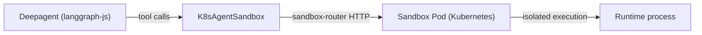

# LangChain deepagents-js with agent-sandbox

A minimal end-to-end example showing how to drive a deepagents-js agent against a Kubernetes-managed sandbox pod via the [`langchain-agent-sandbox`](../../clients/typescript/langchain-agent-sandbox) backend.

This is the TypeScript counterpart to [`examples/langchain-deepagents`](../langchain-deepagents) (Python).

## Architecture



## Prerequisites

- Node 20+ (Node 22 LTS recommended)
- pnpm (or npm/yarn)
- A Kubernetes cluster with the [agent-sandbox](https://github.com/kubernetes-sigs/agent-sandbox) controller deployed
- `kubectl` configured against that cluster
- An `ANTHROPIC_API_KEY` (or swap the model in `main.ts` for any other deepagents-supported provider)

## Running locally against a kind cluster

### 1. Bring up the cluster and controller

```bash
make deploy-kind   # from the repo root
```

### 2. Build and load the sandbox runtime image

```bash
docker build -t sandbox-runtime:latest examples/python-runtime-sandbox/
kind load docker-image sandbox-runtime:latest --name agent-sandbox
```

### 3. Apply the SandboxTemplate

```bash
kubectl apply -f sandbox-template.yaml
```

### 4. Run the example

```bash
pnpm install
export ANTHROPIC_API_KEY=sk-ant-...
pnpm start
```

The agent provisions a fresh sandbox pod, writes a Python file into `/app`, executes it, and prints the result. The pod is deleted when the example exits (`deleteOnClose: true`).

## Connection mode

This example uses the default **tunnel** connection mode, which spawns `kubectl port-forward` to the in-cluster sandbox-router service. No external ingress is required.

For production deployments, prefer the **gateway** mode:

```typescript
const sandbox = await K8sAgentSandbox.create({
  template: "python-deepagent",
  connectionConfig: {
    type: "gateway",
    gatewayName: "sandbox-gateway",
    gatewayNamespace: "infra",
  },
});
```

See the [package README](../../clients/typescript/langchain-agent-sandbox/README.md#connection-modes) for the full connection-mode reference.

## Troubleshooting

| Symptom | Likely cause |
|---|---|
| `SANDBOX_NOT_REACHABLE` on `initialize()` | port-forward didn't come up — check `kubectl get pods -A` and the controller logs |
| `COMMAND_TIMEOUT` thrown by `execute()` | the per-command default timeout (300s) was exceeded — bump `defaultTimeout` in `K8sAgentSandbox.create()` |
| `K8S_API_ERROR` on `create()` | the kubeconfig context can't reach the cluster, or the SandboxTemplate doesn't exist in the namespace |
| Agent loop hangs after a tool call | the model isn't returning a final message — check the model name and your API quota |

## License

Apache-2.0
